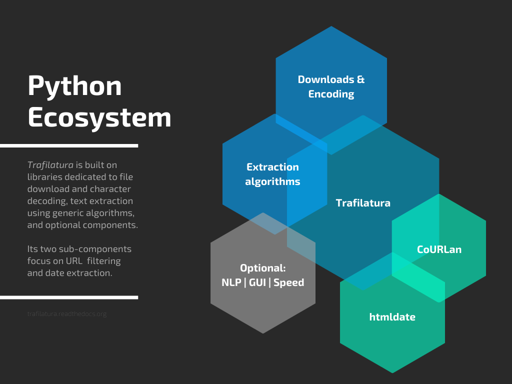

trafilatura: Web scraping tool for text discovery and retrieval
===============================================================

|

.. image:: https://img.shields.io/pypi/v/trafilatura.svg
    :target: https://pypi.python.org/pypi/trafilatura
    :alt: Python package

.. image:: https://img.shields.io/pypi/pyversions/trafilatura.svg
    :target: https://pypi.python.org/pypi/trafilatura
    :alt: Python versions

.. image:: https://readthedocs.org/projects/trafilatura/badge/?version=latest
    :target: http://trafilatura.readthedocs.org/en/latest/?badge=latest
    :alt: Documentation Status

.. image:: https://img.shields.io/codecov/c/github/adbar/trafilatura.svg
    :target: https://codecov.io/gh/adbar/trafilatura
    :alt: Code Coverage

.. image:: https://static.pepy.tech/badge/trafilatura/month
    :target: https://pepy.tech/project/trafilatura
    :alt: Downloads

|

.. image:: docs/trafilatura-demo.gif
    :alt: Demo as GIF image
    :align: center
    :width: 85%
    :target: https://trafilatura.readthedocs.org/

Description
-----------

*Trafilatura* is a Python software package and command-line tool which seamlessly downloads, parses, and scrapes web page data: it can extract text and metadata while preserving parts of text formatting and page structure. This light-weight package acts as a modular toolkit: no database is required, the output can be converted to different commonly used formats.

Features
~~~~~~~~

- Seamless and parallel online/offline processing:
   - Download and conversion utilities included
   - URLs, HTML files or parsed HTML trees as input
- Robust and efficient extraction:
   - Main text and/or comments
   - Structural elements preserved: paragraphs, titles, lists, quotes, code, line breaks, in-line text formatting
   - Extraction of metadata (title, author, date, site name, categories and tags)
- Several output formats supported:
   - Text (minimal formatting or Markdown)
   - CSV (with metadata, `tab-separated values <https://en.wikipedia.org/wiki/Tab-separated_values>`_)
   - JSON (with metadata)
   - XML (for metadata and structure) and `TEI-XML <https://tei-c.org/>`_
- Link discovery and URL lists:
   - Focused crawling and politeness rules
   - Support for sitemaps (TXT, XML) and feeds (ATOM, JSON, RSS)
   - Efficient and polite processing of URL queues
   - Blacklisting
- Optional add-ons:
   - Language detection on extracted content
   - Graphical user interface (GUI)

Evaluation and alternatives
~~~~~~~~~~~~~~~~~~~~~~~~~~~

For more detailed results see the `benchmark <https://trafilatura.readthedocs.io/en/latest/evaluation.html>`_ and `evaluation script <https://github.com/adbar/trafilatura/blob/master/tests/comparison.py>`_. To reproduce the tests just clone the repository, install all necessary packages and run the evaluation script with the data provided in the *tests* directory.

=============================== =========  ========== ========= ========= ======
500 documents, 1487 text and 1496 boilerplate segments (2021-06-07)
--------------------------------------------------------------------------------
Python Package                  Precision  Recall     Accuracy  F-Score   Diff.
=============================== =========  ========== ========= ========= ======
justext 2.2.0 (custom)          0.870      0.584      0.749     0.699     6.1x
newspaper3k 0.2.8               0.921      0.574      0.763     0.708     12.9x
boilerpy3 1.0.2 (article mode)  0.851      0.696      0.788     0.766     4.8x
goose3 3.1.9                    **0.950**  0.644      0.806     0.767     18.8x
*baseline (text markup)*        0.746      0.804      0.766     0.774     **1x**
dragnet 2.0.4                   0.906      0.689      0.810     0.783     3.1x
readability-lxml 0.8.1          0.917      0.716      0.826     0.804     5.9x
news-please 1.5.21              0.924      0.718      0.830     0.808     60x
trafilatura 0.8.2 (fast)        0.925      0.868      0.899     0.896     3.9x
trafilatura 0.8.2               0.934      **0.890**  **0.914** **0.912** 8.4x
=============================== =========  ========== ========= ========= ======

Other evaluations:
^^^^^^^^^^^^^^^^^^

- Most efficient open-source library in *ScrapingHub*'s `article extraction benchmark <https://github.com/scrapinghub/article-extraction-benchmark>`_
- Best overall tool according to Gaël Lejeune & Adrien Barbaresi, `Bien choisir son outil d'extraction de contenu à partir du Web <https://hal.archives-ouvertes.fr/hal-02768510v3/document>`_ (2020, PDF, French)

Usage and documentation
-----------------------

For more information please refer to `the documentation <https://trafilatura.readthedocs.io/>`_:

- `Installation <https://trafilatura.readthedocs.io/en/latest/installation.html>`_
- Usage: `On the command-line <https://trafilatura.readthedocs.io/en/latest/usage-cli.html>`_, `With Python <https://trafilatura.readthedocs.io/en/latest/usage-python.html>`_, `With R <https://trafilatura.readthedocs.io/en/latest/usage-r.html>`_
- `Core Python functions <https://trafilatura.readthedocs.io/en/latest/corefunctions.html>`_
- Python Notebook `Trafilatura Overview <Trafilatura_Overview.ipynb>`_
- `Tutorials <https://trafilatura.readthedocs.io/en/latest/tutorials.html>`_

For video tutorials see this Youtube playlist:

- `Web scraping how-tos and tutorials <https://www.youtube.com/watch?v=8GkiOM17t0Q&list=PL-pKWbySIRGMgxXQOtGIz1-nbfYLvqrci>`_

License
-------

*Trafilatura* is distributed under the `GNU General Public License v3.0 <https://github.com/adbar/trafilatura/blob/master/LICENSE>`_. If you wish to redistribute this library but feel bounded by the license conditions please try interacting `at arms length <https://www.gnu.org/licenses/gpl-faq.html#GPLInProprietarySystem>`_, `multi-licensing <https://en.wikipedia.org/wiki/Multi-licensing>`_ with `compatible licenses <https://en.wikipedia.org/wiki/GNU_General_Public_License#Compatibility_and_multi-licensing>`_, or `contacting me <https://github.com/adbar/trafilatura#author>`_.

See also `GPL and free software licensing: What's in it for business? <https://www.techrepublic.com/blog/cio-insights/gpl-and-free-software-licensing-whats-in-it-for-business/>`_

Context
-------

Contributing
~~~~~~~~~~~~

`Contributions <https://github.com/adbar/trafilatura/blob/master/CONTRIBUTING.md>`_ are welcome! Please also feel free to file issues on the `dedicated page <https://github.com/adbar/trafilatura/issues>`_.

Many thanks to the `contributors <https://github.com/adbar/trafilatura/graphs/contributors>`_ who submitted features and bugfixes!

Roadmap
~~~~~~~

For planned enhancements and relevant milestones see `issues page <https://github.com/adbar/trafilatura/milestones>`_.

Author
~~~~~~

This effort is part of methods to derive information from web documents in order to build `text databases for research <https://www.dwds.de/d/k-web>`_ (chiefly linguistic analysis and natural language processing). Extracting and pre-processing web texts to the exacting standards of scientific research presents a substantial challenge for those who conduct such research. Web corpus construction involves numerous design decisions, and this software package can help facilitate text data collection and enhance corpus quality.

.. image:: https://zenodo.org/badge/DOI/10.5281/zenodo.3460969.svg
   :target: https://doi.org/10.5281/zenodo.3460969

- Barbaresi, A. `Trafilatura: A Web Scraping Library and Command-Line Tool for Text Discovery and Extraction <https://aclanthology.org/2021.acl-demo.15/>`_, Proceedings of ACL/IJCNLP 2021: System Demonstrations, 2021, p. 122-131.
-  Barbaresi, A. "`Generic Web Content Extraction with Open-Source Software <https://hal.archives-ouvertes.fr/hal-02447264/document>`_", Proceedings of KONVENS 2019, Kaleidoscope Abstracts, 2019.
-  Barbaresi, A. "`Efficient construction of metadata-enhanced web corpora <https://hal.archives-ouvertes.fr/hal-01371704v2/document>`_", Proceedings of the `10th Web as Corpus Workshop (WAC-X) <https://www.sigwac.org.uk/wiki/WAC-X>`_, 2016.

.. code-block:: shell

    @inproceedings{barbaresi-2021-trafilatura,
      title = {{Trafilatura: A Web Scraping Library and Command-Line Tool for Text Discovery and Extraction}},
      author = "Barbaresi, Adrien",
      booktitle = "Proceedings of the Joint Conference of the 59th Annual Meeting of the Association for Computational Linguistics and the 11th International Joint Conference on Natural Language Processing: System Demonstrations",
      pages = "122--131",
      publisher = "Association for Computational Linguistics",
      url = "https://aclanthology.org/2021.acl-demo.15",
      year = 2021,
    }

You can contact me via my `contact page <https://adrien.barbaresi.eu/>`_ or `GitHub <https://github.com/adbar>`_.

To have a chat about the software feel free to `book a 15 min slot <https://calendly.com/adbarba/15min>`_ for video-conferencing.

Software
~~~~~~~~

*Trafilatura*: `Italian word <https://en.wiktionary.org/wiki/trafilatura>`_ for `wire drawing <https://en.wikipedia.org/wiki/Wire_drawing>`_.

`Known uses of the software <https://trafilatura.readthedocs.io/en/latest/used-by.html>`_.

Corresponding posts on `Bits of Language <https://adrien.barbaresi.eu/blog/tag/trafilatura.html>`_ (blog).
