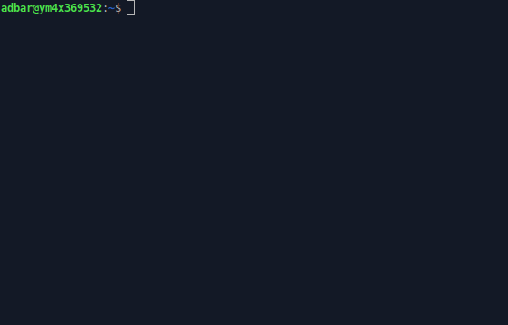
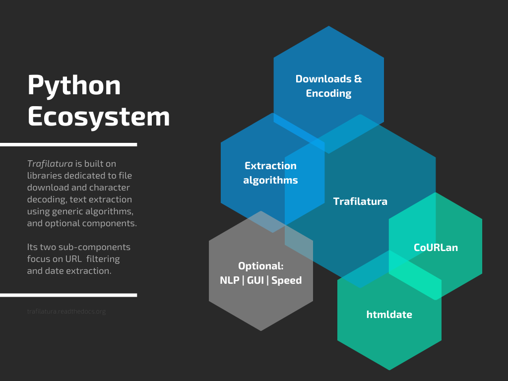

Trafilatura: discover web content, extract text and metadata
=============================================================

.. meta::
    :description lang=en:
        Trafilatura is a Python package and command-line tool to gather text from the web and turn raw HTML into structured data. It handles web crawling, downloads, scraping, and extraction of main texts, metadata and comments.

.. image:: https://img.shields.io/pypi/v/trafilatura.svg
    :target: https://pypi.python.org/pypi/trafilatura
    :alt: Python package

.. image:: https://img.shields.io/pypi/pyversions/trafilatura.svg
    :target: https://pypi.python.org/pypi/trafilatura
    :alt: Python versions

.. image:: https://img.shields.io/codecov/c/github/adbar/trafilatura.svg
    :target: https://codecov.io/gh/adbar/trafilatura
    :alt: Code Coverage

.. image:: https://static.pepy.tech/badge/trafilatura/month
    :target: https://pepy.tech/project/trafilatura
    :alt: Downloads

.. image:: https://img.shields.io/badge/DOI-10.18653%2Fv1%2F2021.acl--demo.15-blue
    :target: https://aclanthology.org/2021.acl-demo.15/
    :alt: Reference DOI: 10.18653/v1/2021.acl-demo.15

|

Description
-----------

Trafilatura is a comprehensive **Python package and command-line tool** designed to **gather text from the Web and turn raw HTML into structured, meaningful data**. It includes all necessary discovery and text processing components to perform **web crawling, downloads, scraping, and extraction** of main texts, metadata and comments. It aims at staying **handy and modular**: no database is required, the output can be converted to commonly used formats.

Going from raw HTML to essential parts, it **focuses on the actual content**, **avoids noise** caused by recurring elements (headers, footers, boilerplate), and **makes sense of the data and metadata**. The extractor strikes a balance between limiting noise (precision) and including all valid parts (recall). It is **robust and reasonably fast**.

Trafilatura is `widely used <used-by.html>`_ across `thousands of projects <https://github.com/adbar/trafilatura/network/dependents>`_, including by HuggingFace, IBM, Microsoft Research, NVIDIA, the Allen Institute for AI, Stanford, and the Internet Archive.

Features
~~~~~~~~

- Advanced web crawling and text discovery:
  - Support for sitemaps (TXT, XML) and feeds (ATOM, JSON, RSS)
  - Smart crawling and URL management (filtering and deduplication)
- Parallel processing of online and offline input:
  - Live URLs, efficient and polite processing of download queues
  - Previously downloaded HTML files and parsed HTML trees
- Robust and configurable extraction of key elements:
  - Main text (own rule-based extractor with jusText and readability-lxml as fallbacks)
  - Metadata (title, author, date, site name, categories and tags)
  - Formatting and structure: paragraphs, titles, lists, quotes, code, line breaks, in-line text formatting
  - Optional elements: comments, links, images, tables
  - Optional add-ons: language detection, speed optimizations
- Multiple output formats:
  - TXT and Markdown
  - CSV
  - JSON
  - HTML, XML and `XML-TEI <https://tei-c.org/>`_

Evaluation
~~~~~~~~~~

Trafilatura consistently outperforms other open-source libraries in text extraction benchmarks. The `benchmark section <evaluation.html>`_ details alternatives and results, the `evaluation readme <https://github.com/adbar/trafilatura/blob/master/tests/README.rst>`_ describes how to reproduce the evaluation.

Quick start
-----------

Primary installation method is with a Python package manager: ``pip install trafilatura`` (→ `installation documentation <installation.html>`_).

With Python:

.. code-block:: python

    >>> from trafilatura import fetch_url, extract
    >>> downloaded = fetch_url('https://github.blog/2019-03-29-leader-spotlight-erin-spiceland/')
    >>> extract(downloaded)
    'Erin Spiceland is a software engineer and ...'
    >>> extract(downloaded, output_format="json", with_metadata=True)
    '{"title": "Leader spotlight: Erin Spiceland", ...}'

On the command-line:

.. code-block:: bash

    $ trafilatura -u "https://github.blog/2019-03-29-leader-spotlight-erin-spiceland/"
    # outputs main content and comments as plain text ...

For more see `usage documentation <usage.html>`_ and `tutorials <tutorials.html>`_.

.. raw:: html

    <iframe width="560" height="315" src="https://www.youtube-nocookie.com/embed/rEOoItpzlVw" frameborder="0" allow="accelerometer; autoplay; clipboard-write; encrypted-media; gyroscope; picture-in-picture" allowfullscreen></iframe>

See the `video tutorials playlist <https://www.youtube.com/watch?v=8GkiOM17t0Q&list=PL-pKWbySIRGMgxXQOtGIz1-nbfYLvqrci>`_ (multiple languages).

License
-------

This package is distributed under the `Apache 2.0 license <https://www.apache.org/licenses/LICENSE-2.0.html>`_.

Versions prior to v1.8.0 are under GPLv3+ license.

Support
-------

**If you value this software or depend on it for your product, consider
sponsoring it and contributing to its codebase.** Your support
`on GitHub <https://github.com/sponsors/adbar>`_ or `ko-fi.com <https://ko-fi.com/adbarbaresi>`_
will help maintain and enhance this package.
Visit the `Contributing page <https://github.com/adbar/trafilatura/blob/master/CONTRIBUTING.md>`_
for more information.

Context
-------

This work started as a PhD project at the crossroads of linguistics and NLP.
This expertise has been instrumental in shaping Trafilatura over the years.
Initially launched to create text databases for research purposes
at the Berlin-Brandenburg Academy of Sciences (DWDS and ZDL units),
this package continues to be maintained and its future depends on community support.

*Trafilatura* is an Italian word for `wire drawing <https://en.wikipedia.org/wiki/Wire_drawing>`_ symbolizing the refinement and conversion process. It is also the way shapes of pasta are formed.

Author
~~~~~~

Reach out via the software repository or the `contact page <https://adrien.barbaresi.eu/>`_ for inquiries, collaborations, or feedback. See also social networks for the latest updates.

- Barbaresi, A. `Trafilatura: A Web Scraping Library and Command-Line Tool for Text Discovery and Extraction <https://aclanthology.org/2021.acl-demo.15/>`_, Proceedings of ACL/IJCNLP 2021: System Demonstrations, 2021, p. 122-131.
- Barbaresi, A. "`Generic Web Content Extraction with Open-Source Software <https://hal.archives-ouvertes.fr/hal-02447264/document>`_", Proceedings of KONVENS 2019, Kaleidoscope Abstracts, 2019.
- Barbaresi, A. "`Efficient construction of metadata-enhanced web corpora <https://hal.archives-ouvertes.fr/hal-01371704v2/document>`_", Proceedings of the `10th Web as Corpus Workshop (WAC-X) <https://www.sigwac.org.uk/wiki/WAC-X>`_, 2016.

Citing Trafilatura
~~~~~~~~~~~~~~~~~~

Trafilatura is widely used in the academic domain, chiefly for data acquisition. Here is how to cite it:

.. image:: https://img.shields.io/badge/DOI-10.18653%2Fv1%2F2021.acl--demo.15-blue
    :target: https://aclanthology.org/2021.acl-demo.15/
    :alt: Reference DOI: 10.18653/v1/2021.acl-demo.15

.. image:: https://zenodo.org/badge/DOI/10.5281/zenodo.3460969.svg
   :target: https://doi.org/10.5281/zenodo.3460969
   :alt: Zenodo archive DOI: 10.5281/zenodo.3460969

.. code-block:: shell

    @inproceedings{barbaresi-2021-trafilatura,
      title = {{Trafilatura: A Web Scraping Library and Command-Line Tool for Text Discovery and Extraction}},
      author = "Barbaresi, Adrien",
      booktitle = "Proceedings of the Joint Conference of the 59th Annual Meeting of the Association for Computational Linguistics and the 11th International Joint Conference on Natural Language Processing: System Demonstrations",
      pages = "122--131",
      publisher = "Association for Computational Linguistics",
      url = "https://aclanthology.org/2021.acl-demo.15",
      year = 2021,
    }

Software ecosystem
~~~~~~~~~~~~~~~~~~

Jointly developed plugins and additional packages also contribute to the field of web data extraction and analysis:

Corresponding posts can be found on
`Bits of Language <https://adrien.barbaresi.eu/blog/tag/trafilatura.html>`_.
The blog covers a range of topics from technical how-tos, updates on new
features, to discussions on text mining challenges and solutions.

Further documentation
=====================

.. toctree::
   :maxdepth: 2
   :caption: Getting started

   installation
   quickstart
   usage

.. toctree::
   :maxdepth: 2
   :caption: Guides & tutorials

   tutorials
   faq
   troubleshooting

.. toctree::
   :maxdepth: 2
   :caption: Reference

   extraction-overview
   evaluation
   corefunctions
   settings
   deprecations
   used-by

For version history and changes see the `changelog <https://github.com/adbar/trafilatura/blob/master/HISTORY.md>`_.

.. toctree::
   :maxdepth: 2
   :caption: Development

   tests

.. toctree::
   :maxdepth: 2
   :caption: Background

   background

:ref:`genindex`
