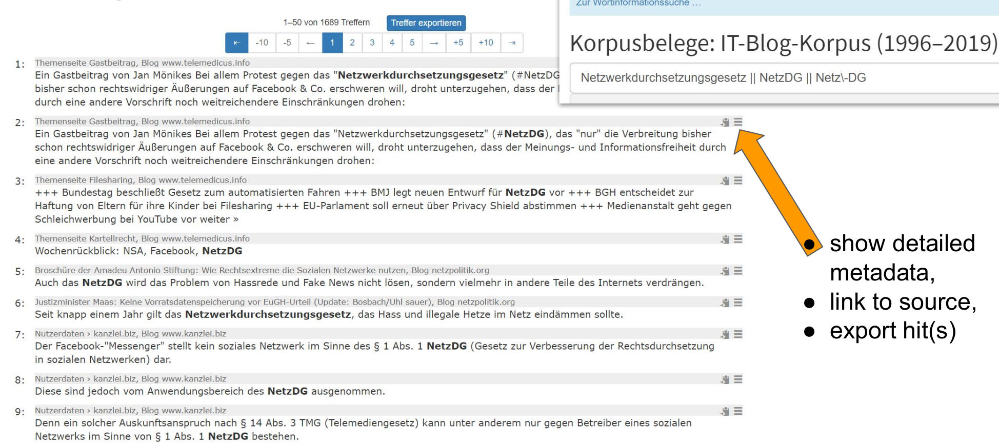

Tutorial: DWDS-Korpusdaten reproduzieren
========================================

Ziel
----

Die Korpusdaten des Digitalen Wörterbuchs der Deutschen Sprache sind mithilfe eines externen Tools reproduzierbar. Anhand dieser Anleitung können Sie Daten unabhängig vom DWDS-Projekt selbst zusammenstellen, speichern und verwalten. Die dafür benötigten Tools sind frei verfügbar und erfordern keine besonderen IT-Kenntnisse.

Das grundsätzliche Problem besteht darin, dass die Originalsammlung vom DWDS selbst nicht uneingeschränkt kopiert und weitergegeben werden darf. Die Nutzung des DWDS-Portals als Suchmaschine ist aber möglich, ebenso wie das Tätigen eigenhändiger Downloads, um die Sammlung zu replizieren. Ein Zugang zu den Rohdaten muss auf diesem Wege nicht gewährt und keine unmittelbare Kopie erzeugt werden.

Bedingungen
-----------

Um die meistens Webkorpora des DWDS online abfragen zu können, ist eine kostenlose Anmeldung notwendig: 
beim DWDS-Portal `registrieren <https://www.dwds.de/profile/register>`_  oder `anmelden <https://www.dwds.de/profile/login>`_.

Für die eigenhändige Zusammenstellung von Korpusdaten brauchen Sie eine aktuelle Version der Software *trafilatura*, siehe `Installation <installation.html>`_ sowie Grundkenntnisse im Umgang mit der Kommandozeile (siehe `Hinweise <usage-cli.html>`_).

Von der einfachen Abfrage zur Einsicht der Quellen
--------------------------------------------------

Mithilfe der Export-Funktion können Links aus den Trefferlisten zur Basis eines eigenen Korpus oder Subkorpus werden.

    Zwei Screenshots vom DWDS-Portal in einem: Abfrage und Trefferliste

Wenn Sie auf „Treffer exportieren“ (blauer Knopf) klicken, haben Sie die Wahl zwischen mehreren Formaten. CSV oder TSV-Dateien z. B. können von LibreOffice Calc und Microsoft Excel geöffnet werden. Die Quellen (URLs) werden in einer Spalte aufgelistet und können dann als getrennte Liste anderswo gespeichert werden.

Download der Daten
------------------

Falls sich die betroffenen Webseiten in der Zeit zwischen dem DWDS-Archiv und Ihrem Download nicht geändert haben, erhalten Sie genau die gleichen Daten.

Im Grunde geben Sie Links (URLs) in der Form einer Liste ein und erhalten als Ausgabe eine Reihe von Dateien als TXT, CSV oder XML. Für weitere Informationen können Sie die folgende Anleitung sowie diese Dokumentationsseiten auf Englisch lesen:

- `Tutorial zum Korpusaufbau <tutorial0.html>`_
- `Nutzung von Trafilatura auf der Kommandozeile <usage-cli.html>`_

Wie kann man gleichzeitig die Seiten herunterladen, speichern und konvertieren?
~~~~~~~~~~~~~~~~~~~~~~~~~~~~~~~~~~~~~~~~~~~~~~~~~~~~~~~~~~~~~~~~~~~~~~~~~~~~~~~

Hier ist eine Empfehlung für die Kommandozeile, die eine Datei namens ``linkliste.txt`` liest (eine URL pro Zeile). Die Ausgabe erfolgt in zweierlei Hinsicht, die extrahierten Texte (TXT-Format) im Verzeichnis ``ausgabe`` und eine Kopie der heruntergeladenen Webseiten unter ``html-quellen`` (zur Archivierung und ggf. erneuten Verarbeitung):

``trafilatura --inputfile linkliste.txt --outputdir ausgabe/ --backup-dir html-quellen/``

So werden TXT-Dateien ohne Metadaten ausgegeben. Wenn Sie ``--csv`` oder ``--xml`` hinzufügen, werden Metadaten einbezogen und das entsprechende Format für die Ausgabe bestimmt.

Für bis zu einige Tausend URLs gelingt dieses Verfahren problemlos von einem Laptop aus, für mehr URLs ist ein Server notwendig, vor allem um lange Wartezeiten zu managen (zunächst werden die Seiten nämlich heruntergeladen).
