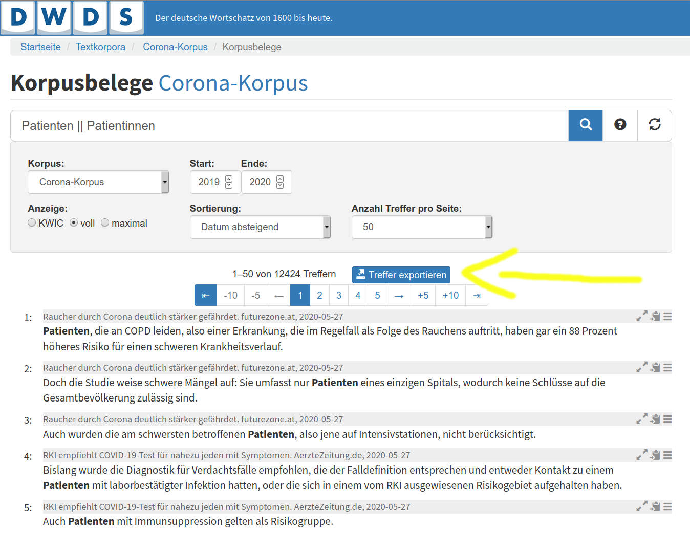
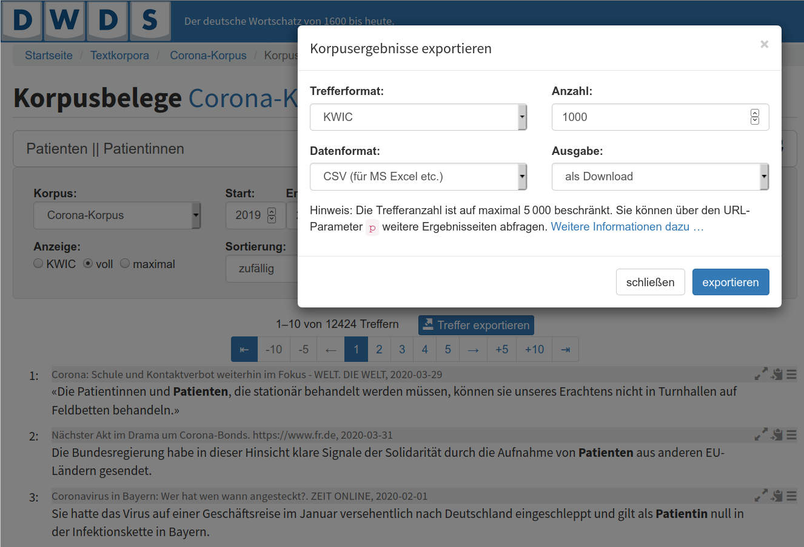
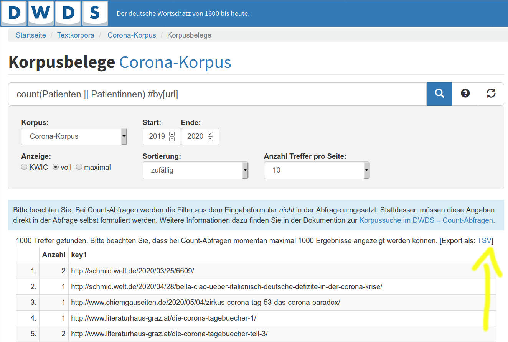

Tutorial: DWDS-Korpusdaten reproduzieren
========================================

Ziel
----

Die Korpusdaten des `Digitalen Wörterbuchs der deutschen Sprache <https://www.dwds.de/>`_ sind mithilfe eines externen Tools reproduzierbar. Anhand dieser Anleitung können Sie Daten unabhängig vom DWDS-Projekt selbst zusammenstellen, speichern und verwalten. Die dafür benötigten Tools sind frei verfügbar und erfordern keine fortgeschrittenen IT-Kenntnisse.

Das grundsätzliche Problem besteht darin, dass die Originalsammlung selbst nicht uneingeschränkt kopiert und weitergegeben werden darf. Die Nutzung des `DWDS-Portals als Suchmaschine <https://www.dwds.de/d/korpussuche>`_ ist aber möglich, ebenso wie das Tätigen eigenhändiger Downloads, um die Sammlung zu replizieren. Auf diesem Wege muss keinen Zugang zu den Rohdaten gewährt und keine unmittelbare Kopie erzeugt werden.

Bedingungen
-----------

Um die meistens Webkorpora des DWDS online abfragen zu können, ist eine kostenlose Anmeldung notwendig: Jede/r kann sich beim DWDS-Portal `registrieren <https://www.dwds.de/profile/register>`_  oder `anmelden <https://www.dwds.de/profile/login>`_.

Für die eigenhändige Zusammenstellung von Korpusdaten brauchen Sie:

1. Grundkenntnisse im Umgang mit der Kommandozeile, siehe `Hinweise <usage-cli.html#introduction>`_ oder diese `Einführung in die Kommandozeile <https://tutorial.djangogirls.org/de/intro_to_command_line/>`_ auf Deutsch
2. Eine aktuelle Version der Software *trafilatura*, siehe `Installation <installation.html>`_

Von der einfachen Abfrage zur Einsicht der Quellen
--------------------------------------------------

Mithilfe der Export-Funktion können Links aus den Trefferlisten zur Basis eines eigenen Korpus oder Subkorpus werden.

Wenn Sie auf den blauen Knopf „Treffer exportieren“ klicken, haben Sie die Wahl zwischen mehreren Formaten. 

    Trefferliste im DWDS-Portal und Knopf „Treffer exportieren“

CSV- oder TSV-Dateien können von der frei verfügbaren Software `LibreOffice Calc <https://www.libreoffice.org/discover/calc/>`_ sowie von Microsoft Excel oder Apple Numbers geöffnet werden. Die Quellen (URLs) werden in einer Spalte aufgelistet und können dann als getrennte Liste anderswo gespeichert werden.

    Kontextmenü „Treffer exportieren“ und Wahl des Ausgabeformats

Alternativ können Sie mit `dieser besonderen Abfragenart <https://www.dwds.de/r?q=count%28Patienten+%7C%7C+Patientinnen%29+%23by%5Burl%5D&corpus=corona&date-start=2019&date-end=2020&format=full&sort=date_desc&limit=10>`_ URLs in gebündelter Form im TSV-Format exportieren:

    Trefferliste nach Quelle sortiert

Nachdem Sie die CSV- oder TSV-Datei mit der Tabellenkalkulationssoftware Ihrer Wahl geöffnet haben, können Sie die `URL-Spalte auswählen <https://help.libreoffice.org/6.4/de/text/swriter/guide/table_select.html>`_ und in einer TXT-Datei kopieren, die Sie als Eingabe für *trafilatura* verwenden werden.

Download der Daten
------------------

Im Grunde geben Sie Links (URLs) in der Form einer Liste ein und erhalten als Ausgabe eine Reihe von Dateien als TXT, CSV oder XML. Für weitere Informationen können Sie die folgende Anleitung sowie diese Dokumentationsseiten auf Englisch lesen:

- `Tutorial zum Korpusaufbau <tutorial0.html>`_
- `Nutzung von Trafilatura auf der Kommandozeile <usage-cli.html>`_

Mehrfach anwesende URLs in der Eingabeliste werden automatisch dedupliziert und die Reihenfolge der Downloads wird optimiert, Sie müssen diese Schritte also nicht selber durchführen.

Falls sich die betroffenen Webseiten in der Zeit zwischen der DWDS-Archivierung und Ihrem Download nicht geändert haben, erhalten Sie genau die gleichen Daten.

Wie kann man gleichzeitig die Seiten herunterladen, speichern und konvertieren?
~~~~~~~~~~~~~~~~~~~~~~~~~~~~~~~~~~~~~~~~~~~~~~~~~~~~~~~~~~~~~~~~~~~~~~~~~~~~~~~

Hier ist eine Empfehlung für die Kommandozeile, die eine Datei namens ``linkliste.txt`` liest (eine URL pro Zeile). Die Ausgabe erfolgt in zweierlei Hinsicht, die extrahierten Texte (TXT-Format) im Verzeichnis ``ausgabe`` und eine Kopie der heruntergeladenen Webseiten unter ``html-quellen`` (zur Archivierung und ggf. erneuten Verarbeitung):

``trafilatura --inputfile linkliste.txt --outputdir ausgabe/ --backup-dir html-quellen/``

So werden TXT-Dateien ohne Metadaten ausgegeben. Wenn Sie ``--csv`` oder ``--xml`` hinzufügen, werden Metadaten einbezogen und das entsprechende Format für die Ausgabe bestimmt.

Für bis zu einige Tausend URLs gelingt dieses Verfahren problemlos von einem Laptop aus, für mehr URLs ist ein Server notwendig, vor allem um lange Wartezeiten zu managen (zunächst werden die Seiten nämlich heruntergeladen).
