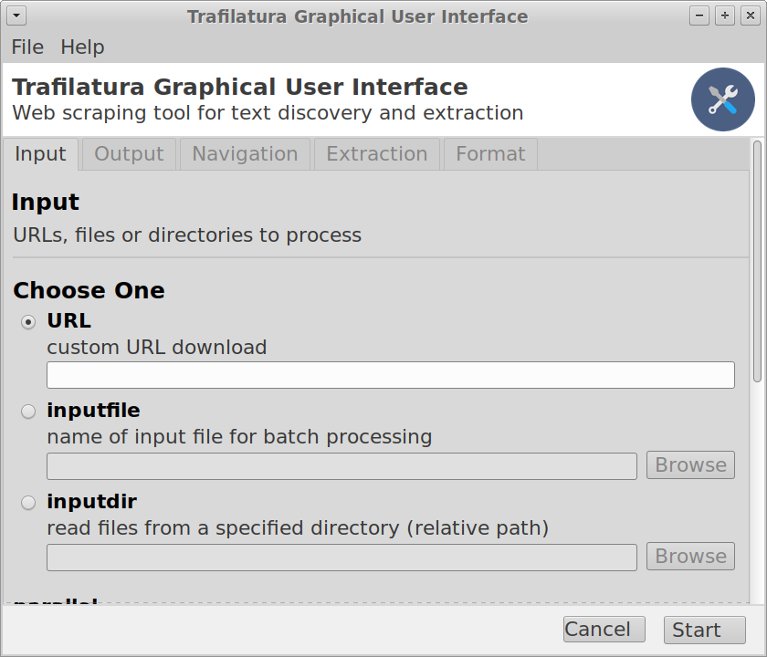

Graphical user interface
========================

For cases where the other usage options do not appear to be convenient, a `graphical user interface <https://en.wikipedia.org/wiki/Graphical_user_interface>`_ (GUI) is available. This type of interface allows for interact with *trafilatura* through graphical icons and menus instead of text-based user interfaces, typed command labels or text navigation.

Although it is still experimental, the interface should provide access to all main functions of *trafilatura*. For more information please refer to the `installation instructions <installation-gui.html>`_.

Screenshot
~~~~~~~~~~

